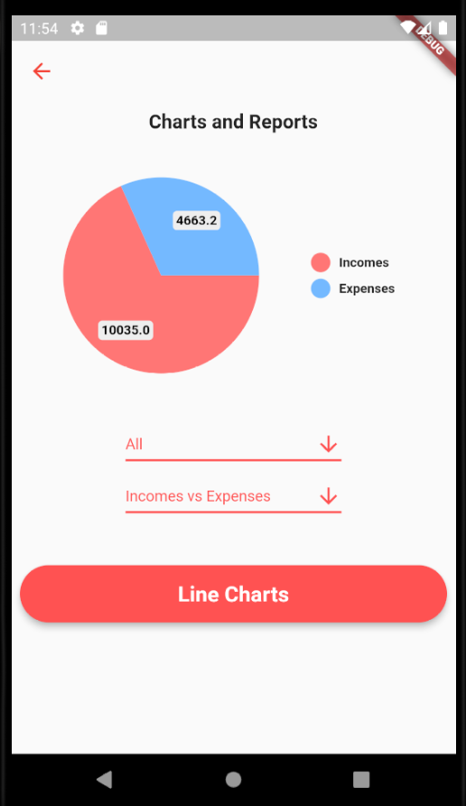
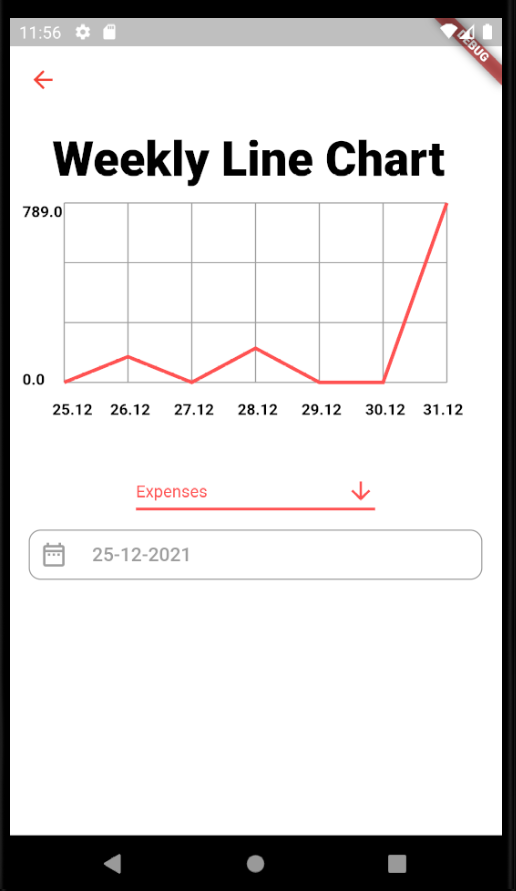

# Bilans

Flutter application to track incomes and expenses using Firebase.

## Overview
In the application user can create an account and add incomes, expenses, income categories, expense categories. For expenses it is possible to add photos to include receipts etc. Two chart options are available: pie chart and line chart (drawn using Custom Painting).

## Technologies
- Flutter
- Firebase
